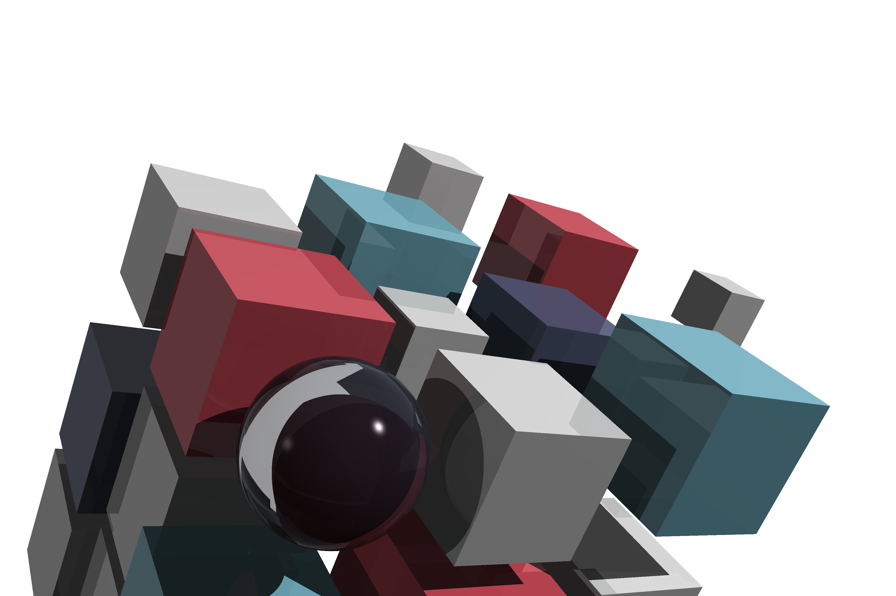
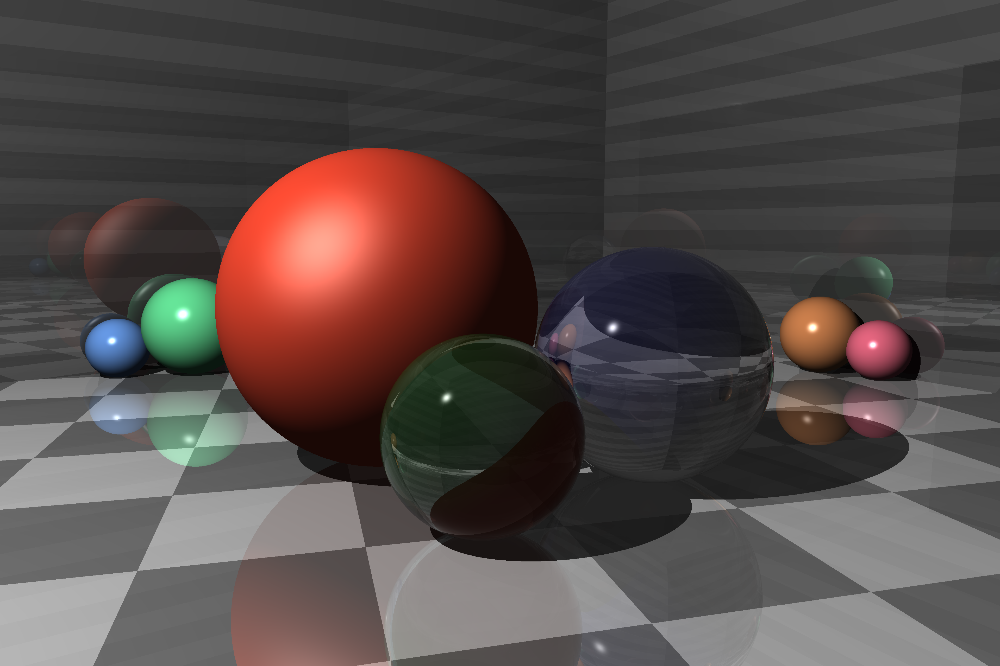
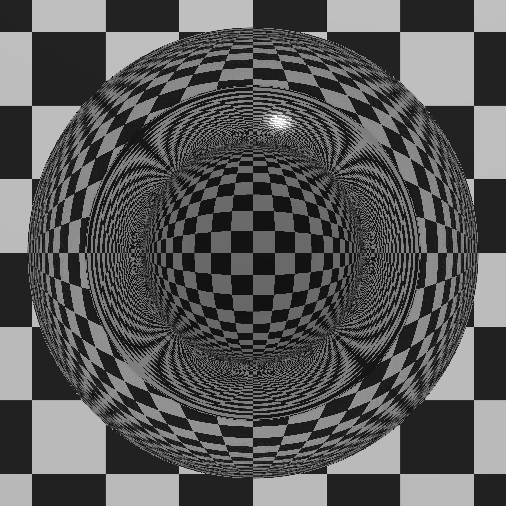
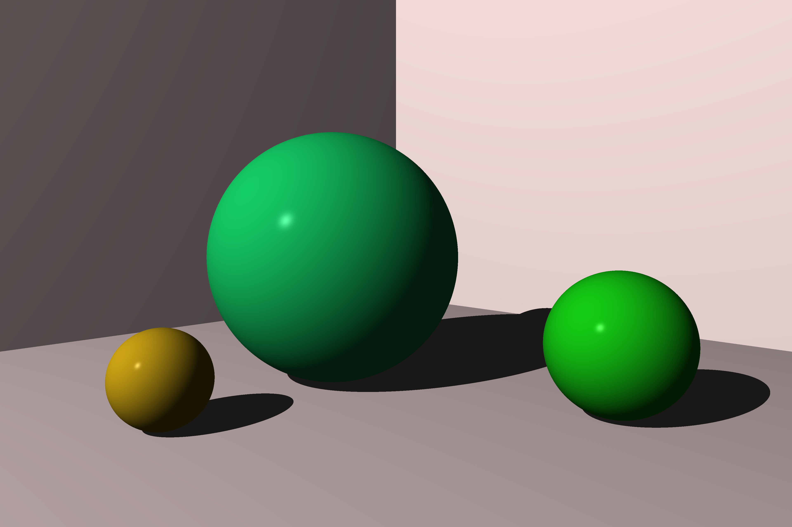

# ray tracer challenge

[](https://github.com/przemo199/ray-tracer-challenge-rs/actions/workflows/tests.yaml)

Implementation of ray tracer from Ray Tracer Challenge book by [Jamis Buck](mailto:jamis@jamisbuck.org) using Rust programming language.

## Features

- Parallelized rendering using [rayon](https://github.com/rayon-rs/rayon)
- No cloning, only borrowed values used in rendering pipeline
- Handling for multiple light sources
- Efficient matrix implementation using const generics
- Shapes and Patterns implemented using traits
- No ```unsafe``` code

## Usage

```
Usage: ray-tracer-challenge.exe [OPTIONS] <SCENE_PATH> <IMAGE_OUTPUT_PATH>

Arguments:
  <SCENE_PATH>
  <IMAGE_OUTPUT_PATH>

Options:
  -r, --rendering-mode <RENDERING_MODE>  [default: serial] [possible values: serial, parallel]
  -h, --help                             Print help
  -V, --version                          Print version
```

## Examples








