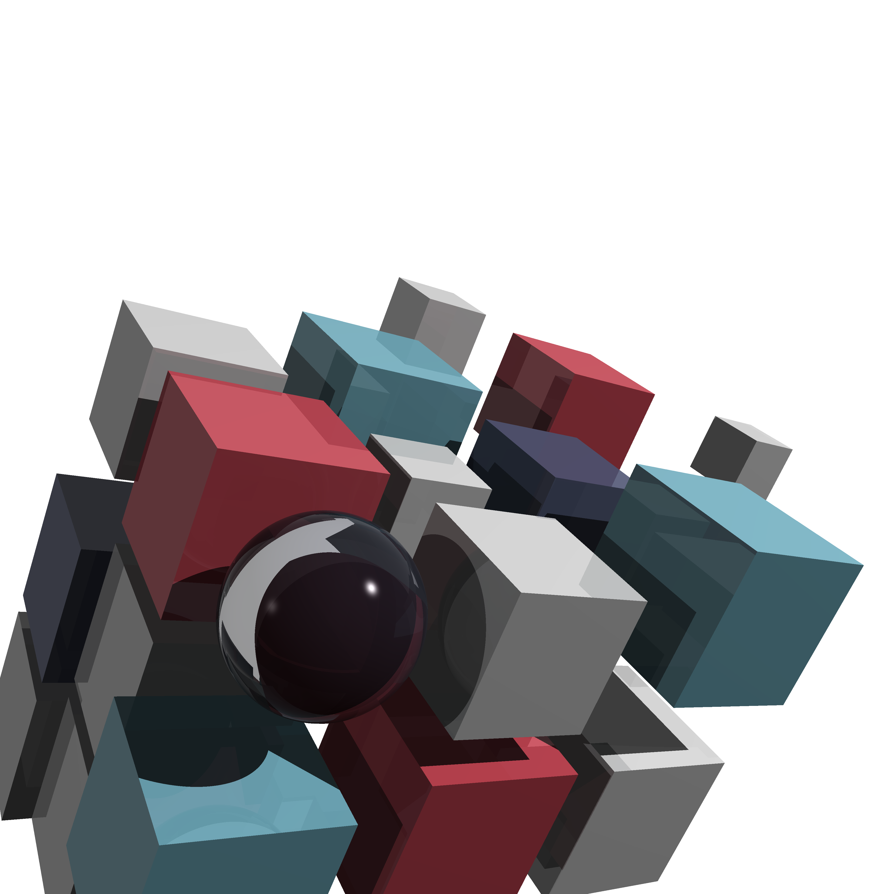
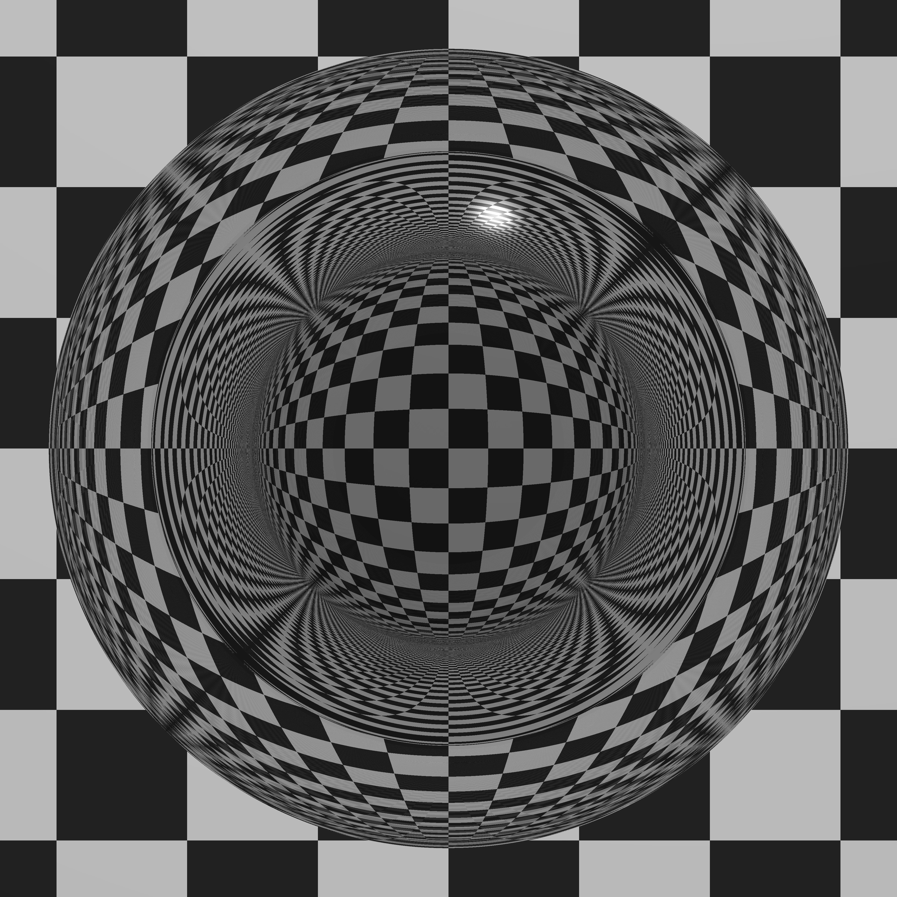

# ray tracer challenge

[](https://github.com/przemo199/ray-tracer-challenge-rs/actions/workflows/tests.yaml)

Implementation of ray tracer from Ray Tracer Challenge book by [Jamis Buck](mailto:jamis@jamisbuck.org) using Rust lang.

## Usage

```
Usage: ray-tracer-challenge.exe <SCENE_PATH> <IMAGE_OUTPUT_PATH>

Arguments:
  <SCENE_PATH>
  <IMAGE_OUTPUT_PATH>

Options:
  -h, --help     Print help
  -V, --version  Print version
```
## Examples





